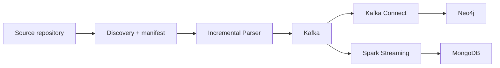

# Lab 04: Incremental Code Property Graph Streaming Pipeline

Đồ án môn Nhập môn Dữ liệu lớn xây dựng pipeline streaming tăng dần để trích xuất Code Property Graph (CPG) từ repository Python, publish event qua Kafka và ingest song song vào Neo4j và MongoDB.

## Tổng quan

Hệ thống phân tích repository `huggingface/transformers-pr-agent` tại commit cố định, tạo manifest discovery, parse từng file Python hợp lệ, sau đó phát các event đã validate schema vào Kafka. Graph topology được ghi trực tiếp vào Neo4j bằng Kafka Connect Sink; metadata file được ghi vào MongoDB bằng Spark Structured Streaming.



## Mục tiêu Lab 04

- Clone hoặc tái sử dụng repository nguồn bằng snapshot có thể tái hiện.
- Enumerate Python files từ repository root, áp dụng file filters và tạo manifest.
- Xây dựng Parser Service xử lý từng file, sinh AST, CFG, DFG, call graph, metadata và parser errors.
- Publish event vào Kafka theo topic contract rõ ràng.
- Ghi graph node/edge vào Neo4j bằng Kafka Connect.
- Ghi metadata vào MongoDB bằng Spark Structured Streaming.
- Kiểm chứng replay tăng dần không tạo duplicate trong các kịch bản đã chạy.

## Repository nguồn

| Hạng mục | Giá trị |
|---|---|
| Repository | `huggingface/transformers-pr-agent` |
| Pinned commit | `458c957fa1e8851825cd799f5d030876f0644194` |
| Raw Python discovery records | 4.496 |
| Eligible parser inputs | 2.963 |

Raw discovery records là toàn bộ file `.py` được ghi nhận trong repository. Eligible parser inputs là các record còn lại sau khi loại tests, setup/build files và generated files theo `config/file_filters.yaml`.

## Các task

| Task | Nội dung |
|---|---|
| Task 1 | Clone repository và discovery file Python |
| Task 2 | Incremental CPG Parser Service |
| Task 3 | Kafka topics và event distribution |
| Task 4 | Kafka Connect -> Neo4j |
| Task 5 | Spark Structured Streaming -> MongoDB |
| Task 6 | Modified-file replay verification |

## Runtime services

Hạ tầng local dùng Docker Compose:

- Kafka KRaft cho event streaming.
- Kafka Connect cho Neo4j sink connectors.
- Neo4j cho graph topology.
- MongoDB cho metadata documents.
- Spark runtime cho Structured Streaming job.

Chi tiết port, endpoint host/container và connector deployment nằm trong [infra/README.md](infra/README.md).

## Topic layout

| Topic | Vai trò |
|---|---|
| `cpg.nodes` | Node upsert/delete events |
| `cpg.edges` | Edge upsert/delete events |
| `source.metadata` | File metadata events cho Spark/MongoDB |
| `parser.errors` | Parser Service business error events |
| `connector.errors` | Kafka Connect dead-letter topic |

Task 4 chỉ xử lý graph path Kafka Connect -> Neo4j. Spark không ghi graph vào Neo4j.

## Quick start

```bash
uv sync --all-extras
cp -n .env.example .env
```

Khởi động hạ tầng:

```bash
docker compose \
  --env-file "$PWD/.env" \
  -f "$PWD/infra/docker-compose.yml" \
  -f "$PWD/infra/docker-compose.neo4j.yml" \
  up -d --build
```

Chuẩn bị source và manifest:

```bash
uv run lab04 clone-source
uv run lab04 discover --scope final --manifest artifacts/manifests/source-files.jsonl
```

Tạo Kafka topics:

```bash
./scripts/create_topics.sh
```

Chạy Parser dry-run:

```bash
uv run lab04 parse-repository --scope smoke --dry-run --clean-output --out-dir workspace/tmp/parser-output
```

Chạy Parser publish Kafka smoke:

```bash
uv run lab04 parse-repository --scope smoke --limit 5 --no-dry-run
```

## Jupyter Book

Báo cáo chính thức nằm trong [lab04-book/](lab04-book/) và được xuất bản tại [GitHub Pages](https://hutaph.github.io/lab04-cpg-streaming/).

| Hạng mục | Giá trị |
|---|---|
| Nhóm thực hiện | Nhóm PPP |
| GitHub repository | [Hutaph/lab04-cpg-streaming](https://github.com/Hutaph/lab04-cpg-streaming) |
| Jupyter Book site | [hutaph.github.io/lab04-cpg-streaming](https://hutaph.github.io/lab04-cpg-streaming/) |

Thành viên:

| MSSV | Họ và tên |
|---|---|
| 23120318 | Trương Quang Phát |
| 23120329 | Châu Huỳnh Phúc |
| 23120334 | Huỳnh Tấn Phước |

Các chương chính:

- [Sơ đồ kiến trúc](lab04-book/architecture_diagram.ipynb)
- [Task 1](lab04-book/task1_clone_explore.ipynb)
- [Task 2](lab04-book/task2_parser_service.ipynb)
- [Task 3](lab04-book/task3_kafka_topics.ipynb)
- [Task 4](lab04-book/task4_neo4j_sink.ipynb)
- [Task 5](lab04-book/task5_spark_mongodb.ipynb)
- [Task 6](lab04-book/task6_idempotent_replay.ipynb)

Build tĩnh từ cached notebook outputs:

```bash
npx mystmd build --html --force
```

## Testing và quality gates

```bash
git diff --check
uv lock --check
uv run python -m compileall -q src scripts spark_jobs
uv run ruff check src tests scripts spark_jobs
uv run ruff format --check src tests scripts spark_jobs
MYPYPATH=src uv run mypy --explicit-package-bases src
PYTHONPATH=src uv run pytest tests/unit -q
```

Integration tests yêu cầu Docker services tương ứng đang chạy:

```bash
PYTHONPATH=src uv run pytest tests/integration -v
```

## Cấu trúc thư mục chính

| Đường dẫn | Vai trò |
|---|---|
| `src/` | Parser application theo layered architecture |
| `schemas/` | JSON Schema cho Kafka events |
| `config/` | Topic, application và file filter config |
| `infra/` | Docker Compose, Kafka Connect và database setup |
| `spark_jobs/` | Spark Structured Streaming job |
| `scripts/` | Utility scripts cho topics, connectors và verification |
| `tests/` | Unit/integration tests |
| `artifacts/manifests/` | Canonical discovery manifest |
| `lab04-book/` | Báo cáo Jupyter Book |
| `workspace/` | Runtime source clone, state, checkpoints và temporary outputs |
