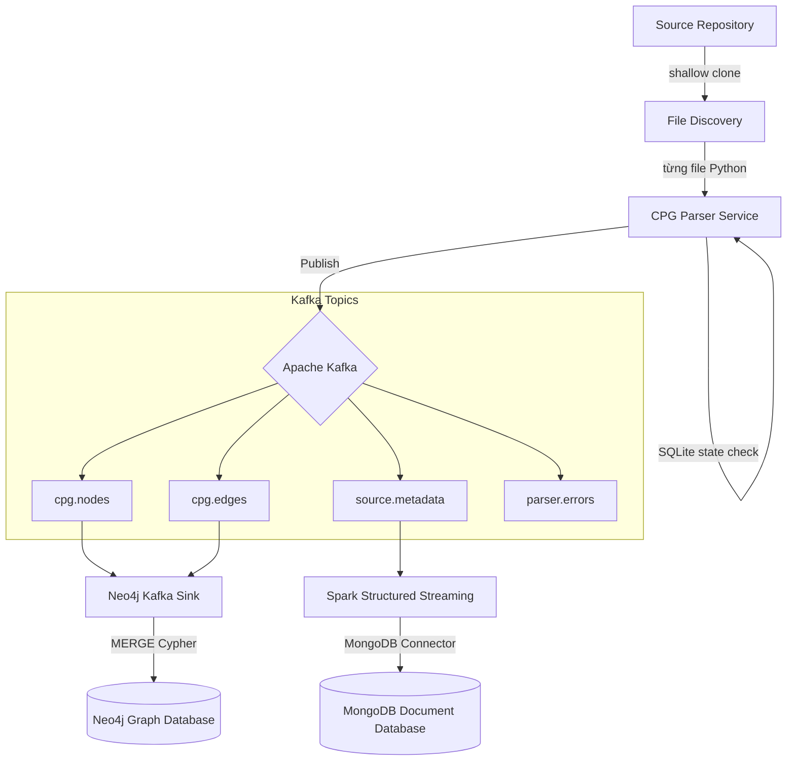

# Lab 04: Incremental Code Property Graph Streaming Pipeline

Đồ án thực hành xây dựng pipeline streaming tăng dần (incremental) trích xuất Code Property Graph (CPG) từ repository Python, truyền tải qua Kafka, nạp song song vào Neo4j (Graph DB) và MongoDB (Document DB).

---

## 1. Overview
- **Repository nguồn phân tích**: `huggingface/transformers-pr-agent` (https://github.com/huggingface/transformers-pr-agent)
- **Mục tiêu**: Phân tích cú pháp sinh AST, CFG, DFG, Call graph từ mã nguồn Python để phục vụ phân tích tĩnh, xử lý streaming thời gian thực.
- **Mô hình Repository**: Repository đồ án này là **độc lập** (`lab04-cpg-streaming`). Repository nguồn mục tiêu được clone shallow tại runtime vào thư mục `workspace/source/` và được ignore hoàn chỉnh khỏi Git.

---

## 2. Current Status

| Task | Description | Status |
|---|---|---|
| **Task 1** | Clone Repository và Khám Phá File | Verified |
| **Task 2** | Parser Service CPG Tăng Dần | Verified locally |
| **Task 3** | Thiết Kế Topic Kafka | Scaffolded / Not started |
| **Task 4** | Ingest Topology Graph vào Neo4j | Scaffolded / Not started |
| **Task 5** | Ingest Metadata Mã Nguồn vào MongoDB | Scaffolded / Not started |
| **Task 6** | Xác Minh Replay Idempotent | Partially implemented (SQLite local) |

---

## 3. Architecture Overview



---

## 4. Quick Start

### 1. Đồng bộ môi trường ảo
```bash
uv sync --all-extras
```

### 2. Shallow Clone repository nguồn mục tiêu
```bash
uv run lab04 clone-source
```

### 3. Khảo sát tệp tin nguồn
```bash
uv run lab04 discover --scope final --manifest artifacts/manifests/source-files.jsonl
```

### 4. Chạy Parser thử nghiệm trên một tệp tin (Dry-run)
```bash
uv run lab04 parse-file --file tests/fixtures/reassignment.py --dry-run --clean-output --out-dir workspace/tmp/parser-output
```

### 5. Chạy Test Suite
```bash
PYTHONPATH=src uv run pytest tests/unit -q
```

---

## 5. Documentation
Tất cả các tài liệu kỹ thuật chi tiết của dự án được duy trì trong thư mục `docs/`:
- **[Documentation Guide](docs/README.md)**: Entrypoint dẫn hướng toàn bộ hệ thống tài liệu.
- **[Architecture Reference](docs/architecture/system_architecture.md)**: Chi tiết kiến trúc hệ thống, luồng dữ liệu, stable ID.
- **[Implementation Plan](docs/planning/implementation_plan.md)**: Kế hoạch triển khai từng phase và DoD.
- **[Task Status (Traceability Matrix)](docs/planning/traceability_matrix.md)**: Theo dõi tiến độ hoàn thành các yêu cầu.
- **[Testing Strategy](docs/quality/testing_strategy.md)**: Hướng dẫn chi tiết chiến dịch chạy test và verify.
- **[Submission Checklist](docs/quality/submission_checklist.md)**: Các tiêu chuẩn tự rà soát định dạng nộp bài.
- **[Jupyter Book Source](lab04-book/)**: Mã nguồn của báo cáo Jupyter Book chính thức.

---

## 6. Submission
- Bài thực hành được nộp chính thức dưới dạng **root URL của published Jupyter Book** (GitHub Pages).
- Moodle **chỉ nhận đúng 1 text entry** chứa URL này. Không chấp nhận nộp file nén ZIP, tệp tài liệu PDF hoặc Word.