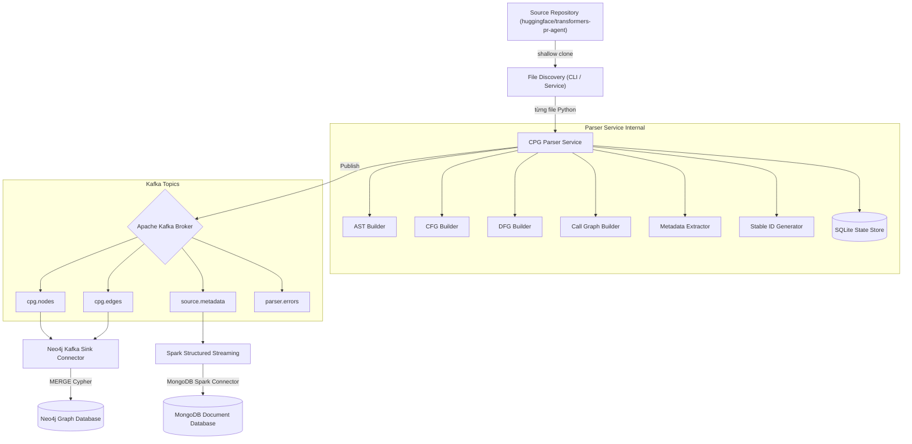
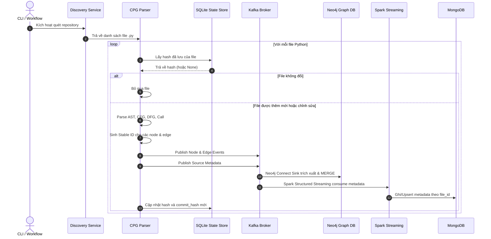

# Kiến trúc Hệ thống Incremental CPG Streaming Pipeline

Tài liệu này mô tả chi tiết thiết kế kiến trúc hệ thống trích xuất Code Property Graph (CPG) tăng dần và ingest streaming dữ liệu mã nguồn trong Lab 04.

## 1. Bối cảnh Lab 04
Trong phân tích chương trình tĩnh, việc hiểu cấu trúc cú pháp và ngữ nghĩa của mã nguồn là cốt lõi. Code Property Graph (CPG) là cấu trúc hợp nhất tích hợp:
- **Abstract Syntax Tree (AST)**: Đại diện cho cấu trúc cú pháp phân cấp.
- **Control Flow Graph (CFG)**: Thể hiện các đường thực thi có thể có của chương trình.
- **Data Flow Graph (DFG)**: Biểu diễn sự lan truyền dữ liệu thông qua các định nghĩa biến và các lần sử dụng (reaching definitions).
- **Call Graph**: Kết nối các điểm gọi hàm (Call Sites) tới định nghĩa hàm tương ứng.

Lab 04 yêu cầu xây dựng một pipeline xử lý streaming tăng dần để trích xuất CPG từ repository Python công khai và lưu trữ topology graph vào Neo4j, đồng thời lưu trữ metadata thống kê vào MongoDB.

## 2. Mục đích của hệ thống
Hệ thống được thiết kế nhằm giải quyết bài toán trích xuất graph mã nguồn ở quy mô lớn với các tiêu chí:
- **Tăng dần (Incremental)**: Chỉ parse và gửi sự kiện cho các file bị chỉnh sửa hoặc thêm mới, tránh parse lại toàn bộ dự án.
- **Tiết kiệm bộ nhớ (Bounded Memory)**: Xử lý theo từng file độc lập thay vì load toàn bộ repository vào memory.
- **Kháng trùng lặp (Idempotent)**: Đảm bảo khi chạy lại (replay) cùng một dữ liệu thì Neo4j và MongoDB không phát sinh bản ghi trùng lặp.
- **Tách biệt lưu trữ**: Sử dụng Neo4j chuyên dụng cho Graph và MongoDB cho tài liệu metadata.

## 3. Đầu vào và đầu ra
- **Đầu vào**: Các file mã nguồn `.py` thuộc repository mục tiêu `huggingface/transformers-pr-agent`.
- **Đầu ra**:
  - Đồ thị CPG được lưu trữ trên **Neo4j** (Node đại diện cho AST/CallTarget, Edge đại diện cho quan hệ cú pháp và luồng).
  - Tài liệu metadata thống kê được lưu trữ trên **MongoDB** (Size, số dòng, số hàm, số class, trạng thái parse).

## 4. Kiến trúc tổng thể
Hệ thống bao gồm các lớp:
1. **Source Discovery**: Khảo sát mã nguồn, sinh danh sách file cần xử lý.
2. **Parser Service**: Phân tích mã nguồn bằng module `ast` của Python, xuất event ra Kafka.
3. **Message Broker**: Apache Kafka quản lý luồng sự kiện truyền tải.
4. **Neo4j Connector**: Kafka Connect Sink đẩy node và edge trực tiếp từ Kafka vào Neo4j.
5. **Spark Streaming**: Apache Spark consume metadata event, thực hiện ghi có cấu trúc vào MongoDB.

## 5. Mermaid Flowchart tổng thể

## 6. Luồng xử lý một file
Mỗi khi một file Python được phát hiện thay đổi:
1. Parser Service kiểm tra file hash hiện tại với SQLite State Store.
2. Nếu hash khác biệt (hoặc chưa tồn tại), parser tiến hành phân tích AST để trích xuất Node, Edge và Metadata.
3. Sinh ID ổn định (Stable ID) cho tất cả các node/edge của file dựa trên sha256 của nội dung và đường dẫn tương đối.
4. Thực hiện diff CPG để tìm ra các node/edge cũ cần xóa (trong trường hợp file bị sửa đổi).
5. Phát hành các node/edge/metadata vào Kafka.
6. Commit trạng thái mới của file vào SQLite State Store sau khi publish thành công.

## 7. Mermaid Sequence Diagram

## 8. Phân chia trách nhiệm từng thành phần
- **File Discovery**: Định vị các file Python nguồn trong workspace, áp dụng bộ lọc (smoke/final) để trả về danh sách file hợp lệ.
- **Parser Service**: Entrypoint điều phối luồng xử lý của từng file.
- **AST Builder**: Duyệt cây cú pháp để trích xuất các node lệnh, biểu thức và thiết lập quan hệ cây cú pháp phân cấp (`AST_CHILD`).
- **CFG Builder**: Xây dựng luồng điều khiển giữa các câu lệnh kề nhau (`CFG_NEXT`).
- **DFG Builder**: Thực hiện giải thuật reaching definitions để nối định nghĩa biến tới nơi sử dụng (`DFG_REACHES`).
- **Call Builder**: Trích xuất các call sites và tạo node `CallTarget` cùng liên kết `CALLS`.
- **Metadata Extractor**: Tính toán số lượng hàm, số lượng lớp, kích thước file và số lượng node/edge được sinh ra.
- **Stable ID**: Generator tạo UUID/Hash ổn định (deterministic) để tránh duplicate.
- **Parser State**: SQLite lưu trữ metadata lịch sử parse cục bộ phục vụ chế độ tăng dần.
- **Kafka**: Broker chịu trách nhiệm truyền tải tin cậy, phân chia topic rạch ròi.
- **Neo4j Kafka Sink**: Connector chạy trên Kafka Connect, đọc node/edge ghi trực tiếp vào Neo4j bằng Cypher query `MERGE`.
- **Spark Structured Streaming**: Job Spark độc lập consume metadata streaming, duy trì offset checkpoint để khôi phục khi lỗi.
- **MongoDB**: Hệ quản trị lưu trữ tài liệu metadata cho phép truy vấn nhanh thống kê mã nguồn.

## 9. Event Schema
Mỗi event được bọc trong một Envelope chung chứa metadata về phiên bản schema, thời gian sự kiện, thông tin repository và file để phục vụ việc truy vết nguồn gốc (provenance):
- `schema_version`: Phiên bản schema (dạng số nguyên).
- `event_id`: Định danh duy nhất của event.
- `event_type`: Loại event (`cpg_node`, `cpg_edge`, `source_metadata`, `parser_error`).
- `event_time`: Timestamp ISO 8601 UTC.
- `repository_id`: Tên/ID của repository nguồn.
- `commit_sha`: Git commit SHA của repository tại thời điểm quét.
- `file_id`: Stable ID của file nguồn.
- `file_path`: Đường dẫn tương đối của file nguồn.
- `content_hash`: SHA-256 hash của nội dung file.
- `parser_version`: Phiên bản của Parser Service.

## 10. Topic Layout
Hệ thống thiết kế 5 topics Kafka rạch ròi:
- `cpg.nodes`: Chứa các node graph.
- `cpg.edges`: Chứa các edge graph.
- `source.metadata`: Chứa metadata thống kê của file.
- `parser.errors`: Dead letter queue cho lỗi parse cú pháp.
- `connector.errors`: Nơi lưu trữ các bản ghi lỗi khi ghi vào Neo4j Connect Sink.

## 11. Stable Identifier (Định danh ổn định)
Để đảm bảo tính idempotent, định danh của các node và edge không được sinh ngẫu nhiên. Quy tắc:
- **Node ID**: `sha256(file_path + "|" + content_hash + "|" + ast_path + "|" + node_type)`
- **Edge ID**: `sha256(edge_type + "|" + source_id + "|" + target_id + "|" + field_name + "|" + index)`
- **File/Metadata ID**: `sha256("metadata" + "|" + file_path)`

## 12. Incremental Processing (Xử lý tăng dần)
Quy trình quét tăng dần hoạt động dựa trên so sánh hash nội dung file:
1. Lấy danh sách toàn bộ file Python hiện có.
2. Với mỗi file, tính SHA-256 nội dung.
3. Đối chiếu với hash đã lưu trong bảng `file_states` của SQLite.
4. Nếu hash trùng khớp: Bỏ qua không parse.
5. Nếu hash khác biệt hoặc không tồn tại: Tiến hành parse và cập nhật state store.

## 13. Idempotency (Tính bất biến)
Mọi tầng trong hệ thống đều phải bảo đảm idempotency:
- **Kafka**: Publisher sử dụng `event_id` làm message key.
- **Neo4j**: Sử dụng Cypher `MERGE` thay vì `CREATE` để đảm bảo ghi đè thuộc tính nếu node/edge đã tồn tại dựa trên `node_id` và `edge_id`.
- **MongoDB**: Sử dụng thao tác `replaceOne` với `upsert: true` dựa trên `file_id` (hoặc `file_path` độc bản) để ghi đè tài liệu metadata cũ khi re-run.

## 14. Stale Node/Edge (Xử lý node/edge mồ côi)
Khi một file bị sửa đổi, cấu trúc cú pháp của nó thay đổi dẫn đến một số node và edge cũ không còn tồn tại. Để tránh Neo4j chứa các node rác:
- Khi re-parse một file, Parser Service truy vấn SQLite để lấy danh sách các `node_id` và `edge_id` đã sinh ra ở phiên bản trước.
- So sánh danh sách ID cũ với danh sách ID mới để tìm ra các ID bị loại bỏ (stale).
- Parser Service phát hành các sự kiện xóa (Delete Events) hoặc trực tiếp thực hiện lệnh xóa các stale elements này qua Kafka Connect (hoặc một cơ chế dọn dẹp chuyên dụng).

## 15. Kafka Ordering
Để đảm bảo tính nhất quán của Graph, thứ tự ghi nhận là rất quan trọng:
- Đảm bảo các node event luôn được Kafka phân phối và xử lý trước các edge event tương ứng.
- Cấu hình phân vùng (partition key) cho các node/edge thuộc cùng một file đi vào cùng một partition Kafka để giữ nguyên thứ tự ghi nhận (Kafka đảm bảo thứ tự message trên từng partition).

## 16. Edge-Before-Node Handling
Trong trường hợp bất đồng bộ khiến edge event đến trước node event tại Neo4j Sink:
- Neo4j Kafka Connect được cấu hình để xử lý khoan dung hoặc sử dụng câu lệnh Cypher tự động khởi tạo node tạm thời khi ghi nhận quan hệ:
  `MATCH (source:CodeNode {node_id: event.source_id})` -> Sử dụng `MERGE (source:CodeNode {node_id: event.source_id})` trước khi tạo quan hệ. Điều này tránh lỗi vi phạm toàn vẹn tham chiếu.

## 17. Spark Checkpoint
Spark Structured Streaming job được cấu hình tham số `checkpointLocation` lưu trữ trên một persistent volume (`workspace/checkpoints/spark`). Điều này đảm bảo:
- Khi job bị crash hoặc khởi động lại, Spark sẽ khôi phục offset của Kafka topic `source.metadata` từ checkpoint gần nhất và tiếp tục consume mà không làm mất mát hoặc xử lý trùng lặp dữ liệu.

## 18. MongoDB Replace/Upsert
Đầu ghi MongoDB trong Spark Streaming sử dụng chế độ ghi đè:
- Dùng `id` (hoặc `file_id`) làm trường khóa chính (`_id`).
- Sử dụng cấu hình ghi `replaceDocument` để cập nhật toàn bộ tài liệu metadata của file tương ứng khi có replay event, tránh phát sinh trùng lặp bản ghi cho cùng một file mã nguồn.

## 19. Lỗi và xử lý lỗi (Error Handling)
- **Lỗi cú pháp (SyntaxError)**: Khi parser gặp file lỗi cấu trúc Python, parser catch exception và phát hành tin nhắn lỗi tới topic `parser.errors`, đồng thời ghi nhận trạng thái `FAILED` vào SQLite state store để không block pipeline.
- **Kafka Down**: Parser Service sẽ dừng lại và retry (backoff) hoặc raise error nếu không thể gửi event sau một khoảng thời gian.
- **Neo4j/MongoDB Down**: Kafka Connect và Spark Streaming sẽ tự động retry ghi nhận message từ Kafka cho đến khi database online trở lại.

## 20. Khả năng quan sát (Observability)
- **Logging**: Console log ghi nhận chi tiết thời gian bắt đầu parse, kết thúc parse, throughput (files/second, nodes/second).
- **Metrics**: Tích hợp module đo đếm hiệu năng thu thập thông số về thời gian parse trung bình của các file, tỷ lệ lỗi trên toàn bộ repository.

## 21. Các lớp kiểm thử (Testing Layers)
- **Unit Tests**: Kiểm tra tính deterministic của stable ID generator, tính đúng đắn của AST/CFG/DFG builders trên các fixture nhỏ.
- **Integration Tests**: Kiểm tra kết nối ghi SQLite state store, kiểm tra gửi tin nhắn Kafka và xác thực schema event.
- **E2E Tests**: Khởi chạy toàn bộ container, thực hiện scan mock repository và assert dữ liệu đích tại Neo4j và MongoDB.

## 22. Luồng triển khai (Deployment Flow)
1. Dựng hạ tầng Kafka, Neo4j, MongoDB thông qua Docker Compose.
2. Tạo các Kafka topics thông qua script tạo topic tự động.
3. Đăng ký connector Neo4j nodes và edges với Kafka Connect.
4. Chạy Spark Structured Streaming job.
5. Thực thi CLI parser quét và phát event.

## 23. Các rủi ro và biện pháp kiểm soát
- **Lỗi tràn bộ nhớ (Out Of Memory) trên Spark/Parser**: Parser chỉ stream từng file nên RAM tiêu thụ cố định. Spark streaming dùng micro-batch giúp kiểm soát lượng dữ liệu nạp.
- **Bất đồng bộ đồ thị (Orphaned edges)**: Sử dụng Cypher MERGE tự tạo node đại diện nếu node đó chưa được import.
- **Spark checkpoint stale**: Khi cấu trúc schema metadata thay đổi, bắt buộc phải xóa checkpoint directory cũ trước khi start job mới.

## 24. Definition of Done (Định nghĩa hoàn thành)
Một file Python được coi là xử lý thành công khi:
- Parser trích xuất thành công AST, CFG, DFG, Call graph mà không gặp lỗi Syntax.
- Toàn bộ Node, Edge và Metadata event được serialize đúng JSON schema và được publish thành công vào Kafka.
- Trạng thái file và content hash được commit thành công vào SQLite state store.

## 25. Kết luận
Kiến trúc hệ thống Incremental CPG Streaming Pipeline đảm bảo tính hiệu quả cao, tiết kiệm tài nguyên hệ thống nhờ cơ chế xử lý tăng dần và streaming bất đồng bộ qua Kafka, đáp ứng các tiêu chuẩn khắt khe về độ tin cậy và idempotency trong phân tích dữ liệu lớn.
