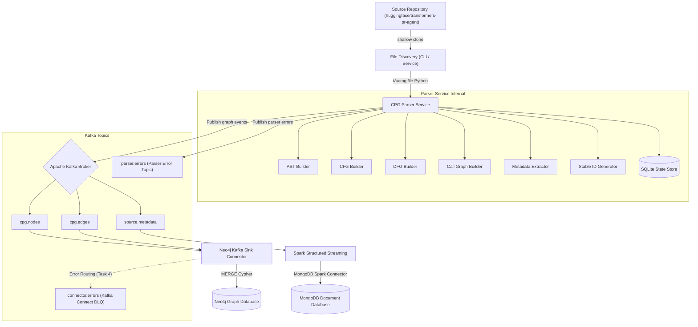

# Kiến trúc Hệ thống Incremental CPG Streaming Pipeline

Tài liệu này mô tả chi tiết thiết kế kiến trúc hệ thống trích xuất Code Property Graph (CPG) tăng dần và ingest streaming dữ liệu mã nguồn trong Lab 04.

---

## 1. Bối cảnh Lab 04
Trong phân tích chương trình tĩnh, việc hiểu cấu trúc cú pháp và ngữ nghĩa của mã nguồn là cốt lõi. Code Property Graph (CPG) là cấu trúc hợp nhất tích hợp:
- **Abstract Syntax Tree (AST)**: �ại diện cho cấu trúc cú pháp phân cấp.
- **Control Flow Graph (CFG)**: Thể hiện các đư�ng thực thi có thể có của chương trình.
- **Data Flow Graph (DFG)**: Biểu diễn sự lan truy�n dữ liệu thông qua các định nghĩa biến và các lần sử dụng (reaching definitions).
- **Call Graph**: Kết nối các điểm g�i hàm (Call Sites) tới định nghĩa hàm tương ứng.

Lab 04 yêu cầu xây dựng một pipeline xử lý streaming tăng dần để trích xuất CPG từ repository Python công khai và lưu trữ topology graph vào Neo4j, đồng th�i lưu trữ metadata thống kê vào MongoDB.

---

## 2. Mục đích của hệ thống
Hệ thống được thiết kế nhằm giải quyết bài toán trích xuất graph mã nguồn ở quy mô lớn với các tiêu chí:
- **Tăng dần (Incremental)**: Chỉ parse và gửi sự kiện cho các file bị chỉnh sửa hoặc thêm mới, tránh parse lại toàn bộ dự án.
- **Tiết kiệm bộ nhớ (Bounded Memory)**: Xử lý theo từng file độc lập thay vì load toàn bộ repository vào memory.
- **Kháng trùng lặp (Idempotent)**: Mục tiêu thiết kế là khi chạy lại (replay) cùng một dữ liệu thì Neo4j và MongoDB không phát sinh bản ghi trùng lặp. Cơ sở là Stable deterministic IDs kết hợp Cypher `MERGE` và uniqueness constraints (Task 4); duplicate handling đầu cuối chưa được kiểm chứng trong Task 3.
- **Tách biệt lưu trữ**: Sử dụng Neo4j chuyên dụng cho Graph và MongoDB cho tài liệu metadata.

---

## 3. �ầu vào và đầu ra
- **�ầu vào**: Các file mã nguồn `.py` thuộc repository mục tiêu `huggingface/transformers-pr-agent`.
- **�ầu ra**:
  - �ồ thị CPG được lưu trữ trên **Neo4j** (Node đại diện cho AST/CallTarget, Edge đại diện cho quan hệ cú pháp và luồng).
  - Tài liệu metadata thống kê được lưu trữ trên **MongoDB** (Size, số dòng, số hàm, số class, trạng thái parse).

---

## 4. Kiến trúc tổng thể
Hệ thống bao gồm các lớp:
1. **Source Discovery**: Khảo sát mã nguồn, sinh danh sách file cần xử lý.
2. **Parser Service**: Phân tích mã nguồn bằng module `ast` của Python, xuất event ra Kafka.
3. **Message Broker**: Apache Kafka quản lý luồng sự kiện truy�n tải.
4. **Neo4j Connector**: Kafka Connect Sink đẩy node và edge trực tiếp từ Kafka vào Neo4j.
5. **Spark Streaming**: Apache Spark consume metadata event, thực hiện ghi có cấu trúc vào MongoDB.



---

## 5. Luồng xử lý một file & Sequence Diagram
Mỗi khi một file Python được phát hiện thay đổi:
1. Parser Service kiểm tra file hash hiện tại với SQLite State Store.
2. Nếu hash khác biệt (hoặc chưa tồn tại), parser tiến hành phân tích AST để trích xuất Node, Edge và Metadata.
3. Sinh ID ổn định (Stable ID) cho tất cả các node/edge của file dựa trên sha256 của nội dung và đư�ng dẫn tương đối.
4. Thực hiện diff CPG để tìm ra các node/edge cũ cần xóa (trong trư�ng hợp file bị sửa đổi).
5. Phát hành các node/edge/metadata vào Kafka dưới dạng một batch duy nhất.
6. Sau khi nhận được **xác nhận (delivery acknowledgement)** thành công từ Kafka broker, parser tiến hành commit trạng thái mới của file vào SQLite State Store cục bộ. Việc commit SQLite diễn ra ngay lập tức và **không ch� đợi** kết quả xử lý của các downstream consumers (Neo4j, Spark, MongoDB). Không tồn tại transaction phân tán (distributed transaction) giữa Kafka và SQLite.

```mermaid
sequenceDiagram
    autonumber
    actor CLI as CLI / Workflow
    participant Discovery as Discovery Service
    participant Parser as CPG Parser
    participant SQLite as SQLite State Store
    participant Kafka as Kafka Broker
    participant Neo4j as Neo4j Graph DB
    participant Spark as Spark Streaming
    participant Mongo as MongoDB

    CLI->>Discovery: Kích hoạt quét repository
    Discovery->>Parser: Trả v� danh sách file .py
    loop Vá»›i má»—i file Python
        Parser->>SQLite: Lấy hash đã lưu của file
        SQLite-->>Parser: Trả v� hash (hoặc None)
        alt File không đổi
            Parser->>Parser: B� qua file
        else File được thêm mới hoặc chỉnh sửa
            Parser->>Parser: Parse AST, CFG, DFG, Call
            Parser->>Parser: Sinh Stable ID cho các node & edge
            Parser->>Kafka: Publish Node, Edge & Metadata Events (Batch)
            Kafka-->>Parser: Delivery Acknowledgement (Xác nhận thành công)
            Parser->>SQLite: Cập nhật hash và commit_hash mới & Commit state
            Note over Parser, SQLite: Commit SQLite diễn ra độc lập, không đợi downstream
            par Downstream Graph Ingestion
                Kafka->>Neo4j: Neo4j Connect Sink consume & MERGE (idempotent)
            and Downstream Metadata Ingestion
                Kafka->>Spark: Spark Structured Streaming consume metadata
                Spark->>Mongo: Ghi/Upsert metadata theo file_id
            end
        end
    end
```



---

## 6. Phân chia trách nhiệm từng thành phần
- **File Discovery**: �ịnh vị các file Python nguồn trong workspace, áp dụng bộ l�c (smoke/final) để trả v� danh sách file hợp lệ.
- **Parser Service**: Entrypoint đi�u phối luồng xử lý của từng file.
- **AST Builder**: Duyệt cây cú pháp để trích xuất các node lệnh, biểu thức và thiết lập quan hệ cây cú pháp phân cấp (`AST_CHILD`).
- **CFG Builder**: Xây dựng luồng đi�u khiển giữa các câu lệnh k� nhau (`CFG_NEXT`).
- **DFG Builder**: Thực hiện giải thuật reaching definitions để nối định nghĩa biến tới nơi sử dụng (`DFG_REACHES`).
- **Call Builder**: Trích xuất các call sites và tạo node `CallTarget` cùng liên kết `CALLS`.
- **Metadata Extractor**: Tính toán số lượng hàm, số lượng lớp, kích thước file và số lượng node/edge được sinh ra.
- **Stable ID**: Generator tạo UUID/Hash ổn định (deterministic) để tránh duplicate.
- **Parser State**: SQLite lưu trữ metadata lịch sử parse cục bộ phục vụ chế độ tăng dần.
- **Kafka**: Broker chịu trách nhiệm truy�n tải tin cậy, phân chia topic rạch ròi.
- **Neo4j Kafka Sink**: Connector chạy trên Kafka Connect, đ�c node/edge ghi trực tiếp vào Neo4j bằng Cypher query `MERGE`.
- **Spark Structured Streaming**: Job Spark độc lập consume metadata streaming, duy trì offset checkpoint để khôi phục khi lỗi.
- **MongoDB**: Hệ quản trị lưu trữ tài liệu metadata cho phép truy vấn nhanh thống kê mã nguồn.

---

## 7. Event Schema
Má»—i event được bá»�c trong má»™t Envelope chung chá»- **Kafka Connect DLQ topic**:
  - `connector.errors`: Kafka Connect Dead Letter Queue chứa các bản ghi lỗi từ downstream connector (được cấu hình và kiểm chứng đầy đủ ở Task 4).
 
### 8.1 Kafka Ordering Semantics (Cơ chế đảm bảo thứ tự của Kafka)
�ể đảm bảo thiết kế downstream và xử lý luồng dữ liệu chính xác, các quy tắc thứ tự sự kiện (ordering semantics) được quy định rõ như sau:
- **Khóa phân vùng (`file_id`)**: `file_id` được sử dụng làm partition key cho các topic. M�i event có cùng `file_id` trong cùng một topic sẽ luôn được định tuyến nhất quán vào cùng một partition.
- **Thứ tự theo từng Topic (Per-Topic Partition Ordering)**: Kafka chỉ bảo đảm thứ tự sự kiện (offset ordering) trong phạm vi **một topic partition duy nhất**. Ví dụ, thứ tự các node event của cùng một file được bảo toàn trong partition của `cpg.nodes`.
- **Không bảo đảm thứ tự xuyên Topic (No Cross-Topic Ordering Guarantee)**: Do `cpg.nodes`, `cpg.edges` và `source.metadata` là các topic độc lập, Kafka **không bảo đảm bất kỳ thứ tự phân phối nào giữa các topic**.
  - Không thể giả định rằng node event luôn được consume trước edge event hoặc ngược lại.
  - Topic offsets của các topic khác nhau là cục bộ và không thể so sánh hay đối chiếu để suy luận thứ tự.
  - Event `FILE_METADATA_UPSERT` được publish cuối cùng trong call sequence của Parser Service, nhưng không đóng vai trò completion barrier ở downstream vì các tin nhắn của topic khác có thể đến sau hoặc được xử lý song song.
- **Yêu cầu đối với Downstream Consumer**: Neo4j consumer (Kafka Connect Sink) phải được thiết kế để chịu được việc xáo trộn thứ tự giữa các topic (order-tolerant) — ví dụ, xử lý được trư�ng hợp edge event đến trước node event.
- **Idempotency**: Crash sau Kafka acknowledgement nhưng trước SQLite commit có thể khiến cùng một batch được publish lại. Stable deterministic IDs tạo cơ sở để Task 4 triển khai Neo4j idempotent writes bằng Cypher `MERGE` và uniqueness constraints, đồng th�i được kiểm chứng toàn phần qua các bài test replay.
- **Tính nhất quán chéo hệ thống**: Task 3 không cung cấp consistency toàn hệ thống. Order-tolerant ingestion, idempotent mutations và stale-event protection cho Neo4j đã được triển khai và kiểm chứng thành công ở Task 4. Spark Structured Streaming và MongoDB upsert semantics thuộc metadata streaming task (Task 5) cũng đã được xác minh.ering Guarantee)**: Do `cpg.nodes`, `cpg.edges` và `source.metadata` là các topic độc lập, Kafka **không bảo đảm bất kỳ thứ tự phân phối nào giữa các topic**.
  - Không thể giả định rằng node event luôn được consume trước edge event hoặc ngược lại.
  - Topic offsets của các topic khác nhau là cục bộ và không thể so sánh hay đối chiếu để suy luận thứ tự.
  - Event `FILE_METADATA_UPSERT` được publish cuối cùng trong call sequence của Parser Service, nhưng không đóng vai trò completion barrier ở downstream vì các tin nhắn của topic khác có thể đến sau hoặc được xử lý song song.
- **Yêu cầu đối với Downstream Consumer**: Neo4j consumer (Kafka Connect Sink) phải được thiết kế để chịu được việc xáo trộn thứ tự giữa các topic (order-tolerant) — ví dụ, xử lý được trư�ng hợp edge event đến trước node event.
- **Idempotency**: Crash sau Kafka acknowledgement nhưng trước SQLite commit có thể khiến cùng một batch được publish lại. Stable deterministic IDs tạo cơ sở để Task 4 triển khai Neo4j idempotent writes; duplicate handling chưa được kiểm chứng trong Task 3.
- **Tính nhất quán chéo hệ thống**: Task 3 không cung cấp consistency toàn hệ thống. Order-tolerant ingestion, idempotent mutations và stale-event protection cho Neo4j phải được triển khai và kiểm chứng ở Task 4. Spark Structured Streaming và MongoDB upsert semantics thuộc metadata streaming task tương ứng.

### 8.2 Error Topic Semantics (Cơ chế và phân loại lỗi hệ thống)
Hệ thống phân định rõ hai mi�n xử lý lỗi (failure domains) độc lập:
1. **parser.errors (Parser Business Error Topic)**:
   - **Bản chất**: Topic sự kiện nghiệp vụ thuộc sở hữu trực tiếp của Parser Service.
   - **Producer**: Parser Service chủ động publish khi phát hiện lỗi xử lý source file (ví dụ: `SyntaxError`, mã hóa không được hỗ trợ).
   - **Event Type**: `PARSER_ERROR` tuân thủ nghiêm ngặt error-event schema.
   - **Hệ quả**: Khi phát hành lỗi, thành quả phân tích graph của file đó bị hủy b�, SQLite state store không được commit hash mới.
   - **Lưu ý**: �ây **không** phải là Dead Letter Queue (DLQ). Lỗi cấu trúc sự kiện (schema validation failure) khi sinh payload sẽ dừng pipeline ngay lập tức và không được route vào topic này để tránh vòng lặp lỗi vô tận.

2. **connector.errors (Kafka Connect Dead Letter Queue)**:
   - **Bản chất**: Kafka Connect Dead Letter Queue (DLQ) dự kiến phục vụ cho hạ tầng Kafka Connect ở Task 4.
   - **Producer**: Kafka Connect framework hoặc Neo4j Sink Connector tự động định tuyến.
   - **Mục đích**: Chứa các records thô ban đầu mà connector không thể xử lý (ví dụ: lỗi kết nối database, lỗi cú pháp truy vấn Cypher).
   - **Lưu ý**: Hoàn toàn tách biệt kh�i luồng lỗi nghiệp vụ của Parser Service. Topic này sẽ được cấu hình và kiểm thử thực tế ở Task 4.

---

## 9. Stable Identifier (�ịnh danh ổn định)
�ể đảm bảo tính idempotent, định danh của các node và edge không được sinh ngẫu nhiên. Quy tắc sinh ID deterministic:
- **File ID**: `sha256(repository_id + "|" + file_path)`
- **Node ID**: `sha256(file_id + "|" + node_type + "|" + qualified_scope + "|" + semantic_key + "|" + ast_path)`
- **Edge ID**: `sha256(source_id + "|" + edge_type + "|" + target_id + "|" + deterministic_role)`
- **Event ID**: `sha256(schema_version + "|" + parser_version + "|" + event_type + "|" + entity_id + "|" + content_hash)`
- **Content Hash**: `sha256` của unmodified file raw bytes (dùng để check sự thay đổi của file).

---

## 10. Cấu trúc thư mục dự án
```
.
├── config/                     # Cấu hình YAML tĩnh của dự án
│   ├── application.yaml
│   ├── file_filters.yaml
│   └── topics.yaml
│
├── schemas/                    # Hợp đồng JSON Schema cho các Kafka events
│   ├── node-event.schema.json
│   ├── edge-event.schema.json
│   ├── metadata-event.schema.json
│   └── error-event.schema.json
│
├── src/                        # Mã nguồn chính của ứng dụng parser
│   ├── domain/                 # Core business models, events và enums
│   ├── application/            # Ports interface và services đi�u phối use case
│   ├── parsing/                # Trình phân tích cú pháp AST, CFG, DFG, Call
│   ├── infrastructure/         # Các concrete adapters kết nối DB/Broker
│   └── cli/                    # CLI commands parser bằng Typer
│
├── spark_jobs/                 # Job xử lý streaming Apache Spark
│   └── metadata_to_mongodb.py
│
├── infra/                      # Triển khai hạ tầng Docker Compose
│   ├── docker-compose.yml
│   ├── kafka-connect/          # Cấu hình Neo4j Connectors
│   ├── neo4j/                  # Setup Cypher constraints
│   └── mongodb/                # Setup MongoDB unique indexes
│
├── scripts/                    # Scripts tiện ích và wrappers chạy nhanh CLI
│   ├── run_discovery.py
│   ├── run_parser.py
│   └── create_topics.sh
│
├── tests/                      # Kiểm thử hệ thống
│   ├── fixtures/               # Mock Python files đầu vào
│   └── unit/                   # Unit tests cho logic core
│
├── lab04-book/                 # Báo cáo Jupyter Book chính thức
│
└── workspace/                  # Thư mục runtime lưu trữ tạm th�i (Gitignored)
    ├── source/                 # Nơi shallow-clone repository nguồn mục tiêu
    ├── state/                  # SQLite parser state store database
    ├── checkpoints/            # Spark streaming checkpoint offsets
    └── tmp/                    # Thư mục xuất file dry-run cục bộ
```

---

## 11. Các quy tắc phụ thuộc & Import (Dependency Rules)
�ể giữ kiến trúc Layered (Hexagonal Architecture) luôn sạch và độc lập kiểm thử:
- **`src/domain/`**: Tuyệt đối độc lập. Không import từ bất kỳ layer nào khác như `application`, `parsing`, `infrastructure`, hay `cli`.
- **`src/parsing/`**: Chỉ được phép phụ thuộc vào `domain`. Không được import các Kafka client, State Store hay CLI.
- **`src/application/`**: Chỉ phụ thuộc vào `domain`. Các use case services tương tác với hạ tầng thông qua các Ports interface khai báo ở `ports.py`, không khởi tạo trực tiếp concrete adapters.
- **`src/infrastructure/`**: Triển khai các interface Port từ application. Lớp này chứa các thư viện ngoài như Kafka client, Sqlite3, Pydantic settings.
- **`src/cli/`**: CLI đóng vai trò là composition root, thực hiện nạp cấu hình và khởi tạo/inject các adapter cụ thể vào service.
- **`spark_jobs/`**: Hoàn toàn tách biệt kh�i parser core, được submit chạy riêng trên Spark Cluster.

---

## 12. Các quyết định thiết kế (Design Decisions / ADRs)

### Quyết định 1: Tách biệt Repository đồ án
- **Bối cảnh**: Cần phân tích repository `huggingface/transformers-pr-agent` nhưng không muốn phát triển code đồ án trực tiếp trong dự án của h� để tránh gây rối git history.
- **Giải pháp**: Xây dựng một repository Lab riêng biệt. Repository nguồn mục tiêu được shallow clone tại runtime vào thư mục `workspace/source/` và được cấu hình gitignored.
- **Hệ quả**: Git history sạch sẽ, độc lập, quản lý mã nguồn g�n gàng.

### Quyết định 2: Sử dụng Python ast module làm Parser Core
- **Bối cảnh**: Cần phân tích cú pháp để sinh CPG Graph. Các thư viện ngoài như Joern hoặc tree-sitter đòi h�i cài đặt môi trư�ng phức tạp và tốn tài nguyên.
- **Giải pháp**: Sử dụng thư viện chuẩn `ast` của Python.
- **Hệ quả**: Service chạy nhẹ, không phụ thuộc thư viện ngoài phức tạp, dễ dàng tích hợp và chạy unit tests.

### Quyết định 3: Thiết lập Stable ID deterministic bằng SHA-256
- **Bối cảnh**: Khi re-run parser hoặc re-play file chỉnh sửa, Neo4j và MongoDB cần cập nhật đúng bản ghi thay vì tạo mới trùng lặp.
- **Giải pháp**: Không dùng UUID ngẫu nhiên. M�i node, edge và file được gán định danh bằng cách băm SHA-256 các thuộc tính cố định.
- **Hệ quả**: Tạo n�n tảng định danh ổn định để Task 4 triển khai Neo4j idempotent writes bằng Cypher `MERGE` và uniqueness constraints. Thiết lập này đã được hoàn thiện và kiểm chứng thành công trong Task 4. MongoDB upsert semantics và Spark checkpoint recovery đã được chứng minh và hoạt động ổn định trong Task 5.

### Quyết định 4: Bố cục Topic Kafka rạch ròi
- **Bối cảnh**: Pipeline cần truy�n nhi�u loại sự kiện (nodes, edges, metadata, errors). Việc gộp chung làm tăng tải l�c tin nhắn cho consumers.
- **Giải pháp**: Thiết kế 5 topics Kafka riêng biệt (`cpg.nodes`, `cpg.edges`, `source.metadata`, `parser.errors`, `connector.errors`).
- **Hệ quả**: Consumer chỉ đ�c đúng topic mong muốn, tối ưu hiệu năng streaming.

### Quyết định 5: Ghi trực tiếp vào Neo4j qua Kafka Connect
- **Bối cảnh**: Cần lưu trữ graph topology vào Neo4j. Việc viết một job SparkSQL trung gian làm tăng độ trễ và tiêu thụ tài nguyên.
- **Giải pháp**: Sử dụng Neo4j Kafka Connector Sink ghi trực tiếp từ topic `cpg.nodes` và `cpg.edges` vào Neo4j bằng các câu lệnh Cypher `MERGE`.
- **Hệ quả**: Ingestion th�i gian thực, độ trễ tối thiểu, giảm tải xử lý của Spark.

### Quyết định 6: SQLite State Store lưu trữ lịch sử cục bộ
- **Bối cảnh**: Parser cần hoạt động theo cơ chế tăng dần (incremental), b� qua các file không thay đổi nội dung.
- **Giải pháp**: Sử dụng một database SQLite nh� tại `workspace/state/parser_state.sqlite3` để lưu vết `content_hash` và danh sách node/edge IDs của mỗi file.
- **Hệ quả**: Parser Service khởi động nhanh, chỉ xử lý các file thực sự chỉnh sửa.

### Quyết định 7: Spark Structured Streaming Ingestion MongoDB
- **Bối cảnh**: Metadata thống kê của file cần được nạp vào MongoDB và cần đảm bảo không mất mát tin nhắn khi hệ thống gặp lỗi.
- **Giải pháp**: Xây dựng job Spark Structured Streaming consume topic `source.metadata` kết hợp với `checkpointLocation` lưu offsets của Kafka.
- **Hệ quả**: Khả năng chịu lỗi cao, tự động khôi phục và tiếp tục từ vị trí offsets đã xử lý gần nhất.

### Quyết định 8: Giải pháp Replay-Safe và Tombstone trong Neo4j
- **Bối cảnh**: Khi một file bị chỉnh sửa hoặc xóa, một số thực thể cũ (Nodes/Edges) sẽ bị xóa kh�i CPG. Tuy nhiên, nếu các sự kiện cũ trong Kafka được phát lại (replay), các lệnh `EDGE_UPSERT` và `NODE_UPSERT` cũ có thể vô tình tái tạo lại các thực thể đã bị xóa này, gây ra hiện tượng "hồi sinh thực thể stale" (stale resurrection).
- **Giải pháp**:
  * Khi thực hiện xóa thực thể Node (`NODE_DELETE`) hoặc Edge (`EDGE_DELETE`), hệ thống luôn tạo ra các bản ghi Tombstone (`CPGNodeTombstone` và `CPGEdgeTombstone`) gắn li�n với định danh thế hệ `generation_id` (`file_id:content_hash:parser_version:schema_version`) từ sự kiện Kafka, không phụ thuộc vào việc thực thể đó có đang tồn tại trong Neo4j hay không.
  * Trong các câu lệnh Cypher Sink, bổ sung đi�u kiện l�c kiểm tra sự tồn tại của Tombstone tương ứng trước khi tiến hành `MERGE` Node hoặc Edge. Thao tác UPSERT của thế hệ cũ sẽ bị b� qua nếu tombstone cùng thế hệ đã được ghi nhận.
  * �ối với các bản ghi không hợp lệ hoặc lỗi định danh (như mismatch endpoint của edge), Kafka Connect được cấu hình đẩy sang Dead Letter Queue (`connector.errors`) thông qua `errors.tolerance = all`.
  * **Hạn chế được chấp nhận (Accepted Limitation)**: Do Neo4j Kafka Sink Connector mặc định thực thi toàn bộ bản ghi trong cùng một batch window thành một transaction duy nhất, bất kỳ lỗi runtime nào của một bản ghi (ví dụ: endpoint mismatch gây ra lỗi chia cho 0) cũng sẽ khiến toàn bộ batch transaction bị rollback ở phía Neo4j. Connector vẫn tiếp tục chạy (`RUNNING`) và đẩy bản ghi lỗi sang DLQ (`connector.errors`), nhưng các bản ghi hợp lệ trong cùng batch đó sẽ bị mất và cần phải được replay/retry lại để ghi thành công.

---

## 13. Ranh giới kiến trúc và Các hạn chế được chấp nhận

Hệ thống hoạt động như một pipeline xử lý phân tán và bất đồng bộ, tuân thủ các ranh giới kiến trúc và chấp nhận các giới hạn kỹ thuật dưới đây:

1. **Không có Distributed Transaction giữa Kafka và SQLite**:
   Parser Service commit trạng thái file vào SQLite cục bộ ngay sau khi nhận được Ack thành công từ Kafka broker. Quá trình này hoàn toàn độc lập với việc ghi nhận của Neo4j và MongoDB phía downstream.
2. **Không bảo đảm thứ tự chéo các Topic (No Cross-Topic Ordering)**:
   Kafka chỉ bảo toàn thứ tự offset trong phạm vi một partition của một topic đơn lẻ (với key phân vùng là `file_id`). Không thể so sánh offset chéo hoặc giả định thứ tự đến giữa các topic `cpg.nodes`, `cpg.edges` và `source.metadata`. Downstream Neo4j tự động xử lý xáo trộn bằng cách tạo node placeholder tạm th�i khi edge đến trước.
3. **Arrival-Order Sensitivity cho các bản ghi lịch sử chéo thế hệ**:
   Hệ thống không cung cấp một cơ chế đánh số thế hệ tăng dần đơn điệu toàn cục (global monotonic generation sequence). Các thao tác upsert chéo thế hệ (ví dụ: phát lại một thế hệ cũ hơn sau khi thế hệ mới đã được ghi thành công) vẫn nhạy cảm với thứ tự đến (arrival-order sensitive).
4. **Cơ chế Rollback theo Batch của Neo4j Connector**:
   Khi một batch chứa một bản ghi lỗi (mismatch endpoint), toàn bộ batch transaction của batch đó sẽ bị rollback ở phía Neo4j. Connector vẫn giữ trạng thái `RUNNING` và đẩy bản ghi lỗi vào DLQ (`connector.errors`), nhưng các bản ghi hợp lệ khác trong batch bị rollback đó sẽ bị mất ở Neo4j và cần được ngư�i dùng replay hoặc retry thủ công. Không được coi là các bản ghi hợp lệ đó đã thành công trong lần chạy đầu tiên.
5. **Không đảm bảo Exactly-Once đầu-cuối (No End-to-End Exactly-Once)**:
   Hệ thống cam kết tính replay-safe bằng idempotency (kháng trùng lặp) hơn là transaction exactly-once toàn trình. Spark checkpoint hỗ trợ khôi phục offset và MongoDB replace upsert theo `file_id` hỗ trợ idempotent metadata update, nhưng không loại trừ hoàn toàn các duplicate tin nhắn trung gian trên mạng lưới.

