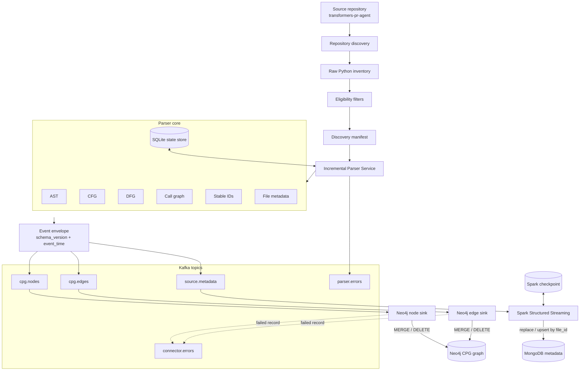
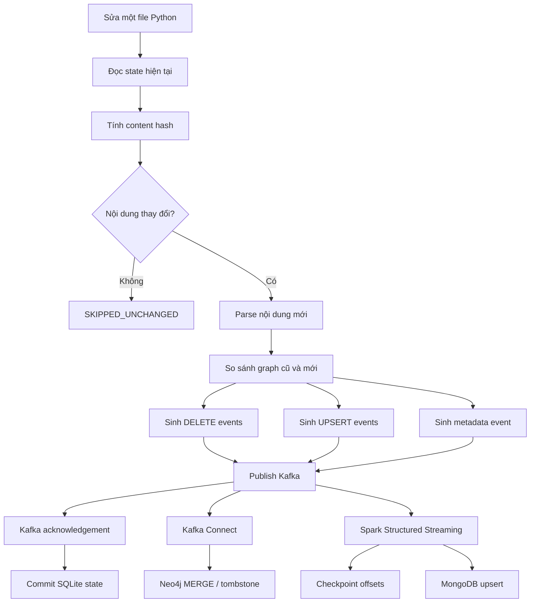

# Kiến trúc hệ thống Incremental CPG Streaming Pipeline

Tài liệu này là technical reference cho Lab 04. Nội dung mô tả cách repository discovery, Parser Service, Kafka, Neo4j, Spark và MongoDB phối hợp để tạo pipeline Code Property Graph (CPG) tăng dần.

## Bối cảnh

CPG hợp nhất nhiều góc nhìn của mã nguồn:

- AST mô tả cấu trúc cú pháp.
- CFG mô tả luồng điều khiển.
- DFG mô tả luồng dữ liệu.
- Call graph mô tả quan hệ gọi hàm.

Lab 04 triển khai pipeline cho repository `huggingface/transformers-pr-agent` tại commit `458c957fa1e8851825cd799f5d030876f0644194`. Discovery ghi nhận 4.496 raw Python records và xác định 2.963 eligible parser inputs sau khi áp dụng file filters.

## Kiến trúc tổng thể

## Repository discovery và manifest

Discovery bắt đầu từ repository root, enumerate toàn bộ file `.py`, rồi áp dụng `config/file_filters.yaml` để xác định record hợp lệ cho Parser Service. Rule loại trừ tập trung vào test files, setup/build files và generated files; không có rule mặc định loại toàn bộ file ngoài `src/`.

Manifest `artifacts/manifests/source-files.jsonl` lưu raw discovery records. Mỗi record có:

- repository ID;
- source commit SHA;
- relative POSIX path;
- file size;
- content hash;
- trạng thái `included`;
- `exclusion_reason` khi record bị loại.

Parser full scope là tập record có `included = true`.

## Parser Service

Parser Service xử lý từng file độc lập để giữ bounded memory. Luồng chính:

1. Đọc eligible manifest.
2. Đọc file và tính content hash.
3. So sánh với SQLite state.
4. Skip nếu file không đổi.
5. Parse bằng module `ast` chuẩn của Python nếu file mới hoặc đã thay đổi.
6. Sinh AST nodes, CFG edges, DFG edges, CALLS edges và metadata.
7. Tạo stable IDs cho file, nodes, edges và events.
8. Validate JSON Schema.
9. Ghi JSONL dry-run hoặc publish Kafka.
10. Commit SQLite state sau writer/Kafka acknowledgement.

Lỗi phân tích source như `SyntaxError` được route thành event `PARSER_ERROR` vào `parser.errors`.

## Stable identifiers

ID không dùng random UUID. Các định danh được sinh deterministic từ path, scope, semantic key, graph endpoints và content metadata.

| ID | Vai trò |
|---|---|
| `file_id` | Định danh file và Kafka key |
| `node_id` | Định danh node CPG ổn định |
| `edge_id` | Định danh edge CPG ổn định |
| `event_id` | Định danh event theo schema/parser/content |
| `content_hash` | Phiên bản nội dung file |
| `generation_id` | Nhóm events của một lần parse nội dung cụ thể |

Stable IDs là nền tảng cho replay-safe ingestion ở Neo4j và MongoDB.

## Kafka event contract

| Topic | Producer | Nội dung | Kafka key |
|---|---|---|---|
| `cpg.nodes` | Parser Service | Node upsert/delete events | `file_id` |
| `cpg.edges` | Parser Service | Edge upsert/delete events | `file_id` |
| `source.metadata` | Parser Service | File metadata events | `file_id` |
| `parser.errors` | Parser Service | Parser business errors | `file_id` |
| `connector.errors` | Kafka Connect | Dead-letter records | connector key |

Event envelope chứa `schema_version`, `event_time`, repository metadata, `file_id`, `source_path`, `content_hash`, `parser_version`, `generation_id` và payload theo từng schema.

Kafka bảo toàn ordering trong một partition của từng topic. Hệ thống không phụ thuộc ordering chéo topic.

## Neo4j graph ingestion

Graph path của Task 4 là Kafka -> Kafka Connect -> Neo4j. Spark không ghi graph vào Neo4j.

Hai connector chính:

| Connector | Topic | Vai trò |
|---|---|---|
| `neo4j-nodes-sink` | `cpg.nodes` | Node upsert/delete |
| `neo4j-edges-sink` | `cpg.edges` | Edge upsert/delete |

Neo4j ingestion dùng:

- uniqueness constraints cho stable node IDs và tombstone IDs;
- Cypher `MERGE` để upsert node/edge;
- idempotent `DELETE` cho events xóa;
- placeholder nodes để chấp nhận edge đến trước node;
- tombstones để chặn stale replay cùng generation;
- DLQ `connector.errors` cho record không ingest được bởi Kafka Connect.

## Spark/MongoDB metadata ingestion

`source.metadata` được consume bởi Spark Structured Streaming. Spark dùng checkpoint để quản lý offsets đã xử lý và ghi MongoDB bằng replace/upsert theo `file_id`.

MongoDB lưu metadata dạng document như path, commit, content hash, parser version, trạng thái parse và thống kê graph. Nhánh này độc lập với Neo4j graph topology.

## Incremental replay

SQLite commit xảy ra sau Kafka acknowledgement và không chờ Neo4j hoặc MongoDB hoàn tất. Downstream consumers xử lý bất đồng bộ bằng cơ chế idempotent riêng.

## Layer boundaries

| Layer | Trách nhiệm | Quy tắc phụ thuộc |
|---|---|---|
| `domain/` | Model, enum, event contract và lỗi nghiệp vụ | Không phụ thuộc layer khác |
| `parsing/` | AST, CFG, DFG, call graph, stable IDs và diff | Chỉ phụ thuộc `domain` |
| `application/` | Use case service và port interface | Giao tiếp qua ports |
| `infrastructure/` | Kafka, JSONL writer, SQLite, config và filesystem adapters | Implement application ports |
| `cli/` | Composition root và dependency injection | Nối các adapter cụ thể |
| `spark_jobs/` | Spark Structured Streaming job | Độc lập với parser core |

## Ranh giới nhất quán

Kafka, SQLite, Neo4j và MongoDB không tham gia cùng một distributed transaction. Hệ thống sử dụng stable IDs, upsert, checkpoint và tombstones để đạt replay-safe behavior cho các kịch bản đã kiểm chứng.
