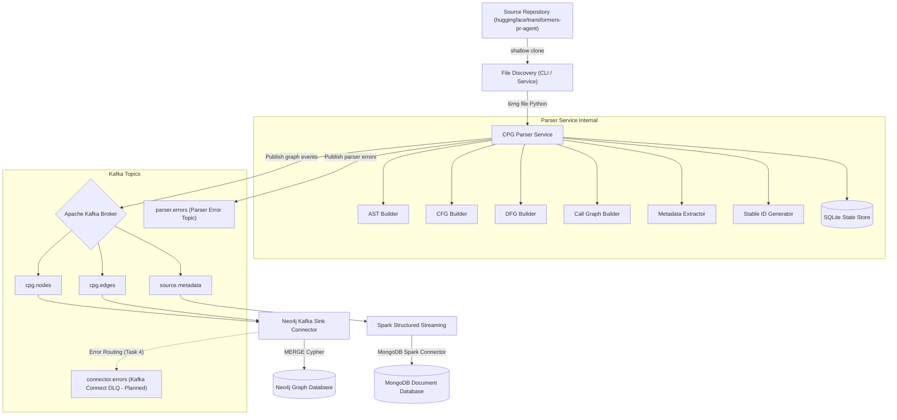
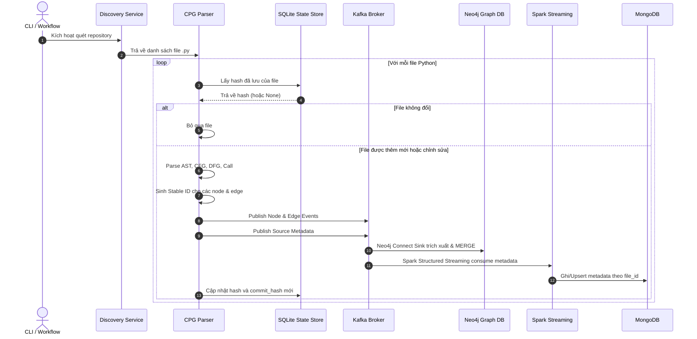

# Kiến trúc Hệ thống Incremental CPG Streaming Pipeline

Tài liệu này mô tả chi tiết thiết kế kiến trúc hệ thống trích xuất Code Property Graph (CPG) tăng dần và ingest streaming dữ liệu mã nguồn trong Lab 04.

---

## 1. Bối cảnh Lab 04
Trong phân tích chương trình tĩnh, việc hiểu cấu trúc cú pháp và ngữ nghĩa của mã nguồn là cốt lõi. Code Property Graph (CPG) là cấu trúc hợp nhất tích hợp:
- **Abstract Syntax Tree (AST)**: Đại diện cho cấu trúc cú pháp phân cấp.
- **Control Flow Graph (CFG)**: Thể hiện các đường thực thi có thể có của chương trình.
- **Data Flow Graph (DFG)**: Biểu diễn sự lan truyền dữ liệu thông qua các định nghĩa biến và các lần sử dụng (reaching definitions).
- **Call Graph**: Kết nối các điểm gọi hàm (Call Sites) tới định nghĩa hàm tương ứng.

Lab 04 yêu cầu xây dựng một pipeline xử lý streaming tăng dần để trích xuất CPG từ repository Python công khai và lưu trữ topology graph vào Neo4j, đồng thời lưu trữ metadata thống kê vào MongoDB.

---

## 2. Mục đích của hệ thống
Hệ thống được thiết kế nhằm giải quyết bài toán trích xuất graph mã nguồn ở quy mô lớn với các tiêu chí:
- **Tăng dần (Incremental)**: Chỉ parse và gửi sự kiện cho các file bị chỉnh sửa hoặc thêm mới, tránh parse lại toàn bộ dự án.
- **Tiết kiệm bộ nhớ (Bounded Memory)**: Xử lý theo từng file độc lập thay vì load toàn bộ repository vào memory.
- **Kháng trùng lặp (Idempotent)**: Đảm bảo khi chạy lại (replay) cùng một dữ liệu thì Neo4j và MongoDB không phát sinh bản ghi trùng lặp.
- **Tách biệt lưu trữ**: Sử dụng Neo4j chuyên dụng cho Graph và MongoDB cho tài liệu metadata.

---

## 3. Đầu vào và đầu ra
- **Đầu vào**: Các file mã nguồn `.py` thuộc repository mục tiêu `huggingface/transformers-pr-agent`.
- **Đầu ra**:
  - Đồ thị CPG được lưu trữ trên **Neo4j** (Node đại diện cho AST/CallTarget, Edge đại diện cho quan hệ cú pháp và luồng).
  - Tài liệu metadata thống kê được lưu trữ trên **MongoDB** (Size, số dòng, số hàm, số class, trạng thái parse).

---

## 4. Kiến trúc tổng thể
Hệ thống bao gồm các lớp:
1. **Source Discovery**: Khảo sát mã nguồn, sinh danh sách file cần xử lý.
2. **Parser Service**: Phân tích mã nguồn bằng module `ast` của Python, xuất event ra Kafka.
3. **Message Broker**: Apache Kafka quản lý luồng sự kiện truyền tải.
4. **Neo4j Connector**: Kafka Connect Sink đẩy node và edge trực tiếp từ Kafka vào Neo4j.
5. **Spark Streaming**: Apache Spark consume metadata event, thực hiện ghi có cấu trúc vào MongoDB.



---

## 5. Luồng xử lý một file & Sequence Diagram
Mỗi khi một file Python được phát hiện thay đổi:
1. Parser Service kiểm tra file hash hiện tại với SQLite State Store.
2. Nếu hash khác biệt (hoặc chưa tồn tại), parser tiến hành phân tích AST để trích xuất Node, Edge và Metadata.
3. Sinh ID ổn định (Stable ID) cho tất cả các node/edge của file dựa trên sha256 của nội dung và đường dẫn tương đối.
4. Thực hiện diff CPG để tìm ra các node/edge cũ cần xóa (trong trường hợp file bị sửa đổi).
5. Phát hành các node/edge/metadata vào Kafka.
6. Commit trạng thái mới của file vào SQLite State Store sau khi publish thành công.



---

## 6. Phân chia trách nhiệm từng thành phần
- **File Discovery**: Định vị các file Python nguồn trong workspace, áp dụng bộ lọc (smoke/final) để trả về danh sách file hợp lệ.
- **Parser Service**: Entrypoint điều phối luồng xử lý của từng file.
- **AST Builder**: Duyệt cây cú pháp để trích xuất các node lệnh, biểu thức và thiết lập quan hệ cây cú pháp phân cấp (`AST_CHILD`).
- **CFG Builder**: Xây dựng luồng điều khiển giữa các câu lệnh kề nhau (`CFG_NEXT`).
- **DFG Builder**: Thực hiện giải thuật reaching definitions để nối định nghĩa biến tới nơi sử dụng (`DFG_REACHES`).
- **Call Builder**: Trích xuất các call sites và tạo node `CallTarget` cùng liên kết `CALLS`.
- **Metadata Extractor**: Tính toán số lượng hàm, số lượng lớp, kích thước file và số lượng node/edge được sinh ra.
- **Stable ID**: Generator tạo UUID/Hash ổn định (deterministic) để tránh duplicate.
- **Parser State**: SQLite lưu trữ metadata lịch sử parse cục bộ phục vụ chế độ tăng dần.
- **Kafka**: Broker chịu trách nhiệm truyền tải tin cậy, phân chia topic rạch ròi.
- **Neo4j Kafka Sink**: Connector chạy trên Kafka Connect, đọc node/edge ghi trực tiếp vào Neo4j bằng Cypher query `MERGE`.
- **Spark Structured Streaming**: Job Spark độc lập consume metadata streaming, duy trì offset checkpoint để khôi phục khi lỗi.
- **MongoDB**: Hệ quản trị lưu trữ tài liệu metadata cho phép truy vấn nhanh thống kê mã nguồn.

---

## 7. Event Schema
Mỗi event được bọc trong một Envelope chung chứa metadata về phiên bản schema, thời gian sự kiện, thông tin repository và file để phục vụ việc truy vết nguồn gốc (provenance):
- `schema_version`: Phiên bản schema (dạng string, mặc định là `"1.0"`).
- `event_id`: Định danh duy nhất của event.
- `event_type`: Loại event (`NODE_UPSERT`, `NODE_DELETE`, `EDGE_UPSERT`, `EDGE_DELETE`, `FILE_METADATA_UPSERT`, `PARSER_ERROR`).
- `event_time`: Timestamp ISO 8601 UTC.
- `repository_id`: Tên/ID của repository nguồn.
- `commit_sha`: Git commit SHA của repository tại thời điểm quét.
- `file_id`: Stable ID của file nguồn.
- `file_path`: Đường dẫn tương đối của file nguồn.
- `content_hash`: SHA-256 hash của nội dung file.
- `parser_version`: Phiên bản của Parser Service.

---

## 8. Topic Layout
Hệ thống cấu hình 5 topics Kafka rạch ròi:
- **Required Task 3 topics**:
  - `cpg.nodes`: Chứa các node graph.
  - `cpg.edges`: Chứa các edge graph.
  - `source.metadata`: Chứa metadata thống kê của file.
  - `parser.errors`: Topic chứa các sự kiện lỗi nghiệp vụ (PARSER_ERROR) sinh ra khi parser phân tích thất bại.
- **Planned Kafka Connect DLQ topic**:
  - `connector.errors`: Kafka Connect Dead Letter Queue chứa các bản ghi lỗi từ downstream connector (dự kiến ở Task 4, chưa được kiểm chứng runtime trong Task 3).

### 8.1 Kafka Ordering Semantics (Cơ chế đảm bảo thứ tự của Kafka)
Để đảm bảo thiết kế downstream và xử lý luồng dữ liệu chính xác, các quy tắc thứ tự sự kiện (ordering semantics) được quy định rõ như sau:
- **Khóa phân vùng (`file_id`)**: `file_id` được sử dụng làm partition key cho các topic. Mọi event có cùng `file_id` trong cùng một topic sẽ luôn được định tuyến nhất quán vào cùng một partition.
- **Thứ tự theo từng Topic (Per-Topic Partition Ordering)**: Kafka chỉ bảo đảm thứ tự sự kiện (offset ordering) trong phạm vi **một topic partition duy nhất**. Ví dụ, thứ tự các node event của cùng một file được bảo toàn trong partition của `cpg.nodes`.
- **Không bảo đảm thứ tự xuyên Topic (No Cross-Topic Ordering Guarantee)**: Do `cpg.nodes`, `cpg.edges` và `source.metadata` là các topic độc lập, Kafka **không bảo đảm bất kỳ thứ tự phân phối nào giữa các topic**.
  - Không thể giả định rằng node event luôn được consume trước edge event hoặc ngược lại.
  - Topic offsets của các topic khác nhau là cục bộ và không thể so sánh hay đối chiếu để suy luận thứ tự.
  - Event `FILE_METADATA_UPSERT` được publish cuối cùng trong call sequence của Parser Service, nhưng không đóng vai trò completion barrier ở downstream vì các tin nhắn của topic khác có thể đến sau hoặc được xử lý song song.
- **Yêu cầu đối với Downstream Consumer**: Neo4j consumer (Kafka Connect Sink) phải được thiết kế để chịu được việc xáo trộn thứ tự giữa các topic (order-tolerant) — ví dụ, xử lý được trường hợp edge event đến trước node event.
- **Idempotency**: Crash sau Kafka acknowledgement nhưng trước SQLite commit có thể khiến cùng một batch được publish lại. Stable deterministic IDs tạo cơ sở để Task 4 triển khai idempotent database writes; duplicate handling chưa được kiểm chứng trong Task 3.
- **Tính nhất quán chéo hệ thống**: Task 3 không cung cấp consistency toàn hệ thống. Order-tolerant ingestion, idempotent mutations và stale-event protection phải được triển khai và kiểm chứng ở Task 4.

### 8.2 Error Topic Semantics (Cơ chế và phân loại lỗi hệ thống)
Hệ thống phân định rõ hai miền xử lý lỗi (failure domains) độc lập:
1. **parser.errors (Parser Business Error Topic)**:
   - **Bản chất**: Topic sự kiện nghiệp vụ thuộc sở hữu trực tiếp của Parser Service.
   - **Producer**: Parser Service chủ động publish khi phát hiện lỗi xử lý source file (ví dụ: `SyntaxError`, mã hóa không được hỗ trợ).
   - **Event Type**: `PARSER_ERROR` tuân thủ nghiêm ngặt error-event schema.
   - **Hệ quả**: Khi phát hành lỗi, thành quả phân tích graph của file đó bị hủy bỏ, SQLite state store không được commit hash mới.
   - **Lưu ý**: Đây **không** phải là Dead Letter Queue (DLQ). Lỗi cấu trúc sự kiện (schema validation failure) khi sinh payload sẽ dừng pipeline ngay lập tức và không được route vào topic này để tránh vòng lặp lỗi vô tận.

2. **connector.errors (Kafka Connect Dead Letter Queue)**:
   - **Bản chất**: Kafka Connect Dead Letter Queue (DLQ) dự kiến phục vụ cho hạ tầng Kafka Connect ở Task 4.
   - **Producer**: Kafka Connect framework hoặc Neo4j Sink Connector tự động định tuyến.
   - **Mục đích**: Chứa các records thô ban đầu mà connector không thể xử lý (ví dụ: lỗi kết nối database, lỗi cú pháp truy vấn Cypher).
   - **Lưu ý**: Hoàn toàn tách biệt khỏi luồng lỗi nghiệp vụ của Parser Service. Topic này sẽ được cấu hình và kiểm thử thực tế ở Task 4.

---

## 9. Stable Identifier (Định danh ổn định)
Để đảm bảo tính idempotent, định danh của các node và edge không được sinh ngẫu nhiên. Quy tắc sinh ID deterministic:
- **File ID**: `sha256(repository_id + "|" + file_path)`
- **Node ID**: `sha256(file_id + "|" + node_type + "|" + qualified_scope + "|" + semantic_key + "|" + ast_path)`
- **Edge ID**: `sha256(source_id + "|" + edge_type + "|" + target_id + "|" + deterministic_role)`
- **Content Hash**: `sha256` của unmodified file raw bytes (dùng để check sự thay đổi của file).

---

## 10. Cấu trúc thư mục dự án
```
.
├── config/                     # Cấu hình YAML tĩnh của dự án
│   ├── application.yaml
│   ├── file_filters.yaml
│   └── topics.yaml
│
├── schemas/                    # Hợp đồng JSON Schema cho các Kafka events
│   ├── node-event.schema.json
│   ├── edge-event.schema.json
│   ├── metadata-event.schema.json
│   └── error-event.schema.json
│
├── src/                        # Mã nguồn chính của ứng dụng parser
│   ├── domain/                 # Core business models, events và enums
│   ├── application/            # Ports interface và services điều phối use case
│   ├── parsing/                # Trình phân tích cú pháp AST, CFG, DFG, Call
│   ├── infrastructure/         # Các concrete adapters kết nối DB/Broker
│   └── cli/                    # CLI commands parser bằng Typer
│
├── spark_jobs/                 # Job xử lý streaming Apache Spark
│   └── metadata_to_mongodb.py
│
├── infra/                      # Triển khai hạ tầng Docker Compose
│   ├── docker-compose.yml
│   ├── kafka-connect/          # Cấu hình Neo4j Connectors
│   ├── neo4j/                  # Setup Cypher constraints
│   └── mongodb/                # Setup MongoDB unique indexes
│
├── scripts/                    # Scripts tiện ích và wrappers chạy nhanh CLI
│   ├── run_discovery.py
│   ├── run_parser.py
│   └── create_topics.sh
│
├── tests/                      # Kiểm thử hệ thống
│   ├── fixtures/               # Mock Python files đầu vào
│   └── unit/                   # Unit tests cho logic core
│
├── lab04-book/                 # Báo cáo Jupyter Book chính thức
│
└── workspace/                  # Thư mục runtime lưu trữ tạm thời (Gitignored)
    ├── source/                 # Nơi shallow-clone repository nguồn mục tiêu
    ├── state/                  # SQLite parser state store database
    ├── checkpoints/            # Spark streaming checkpoint offsets
    └── tmp/                    # Thư mục xuất file dry-run cục bộ
```

---

## 11. Các quy tắc phụ thuộc & Import (Dependency Rules)
Để giữ kiến trúc Layered (Hexagonal Architecture) luôn sạch và độc lập kiểm thử:
- **`src/domain/`**: Tuyệt đối độc lập. Không import từ bất kỳ layer nào khác như `application`, `parsing`, `infrastructure`, hay `cli`.
- **`src/parsing/`**: Chỉ được phép phụ thuộc vào `domain`. Không được import các Kafka client, State Store hay CLI.
- **`src/application/`**: Chỉ phụ thuộc vào `domain`. Các use case services tương tác với hạ tầng thông qua các Ports interface khai báo ở `ports.py`, không khởi tạo trực tiếp concrete adapters.
- **`src/infrastructure/`**: Triển khai các interface Port từ application. Lớp này chứa các thư viện ngoài như Kafka client, Sqlite3, Pydantic settings.
- **`src/cli/`**: CLI đóng vai trò là composition root, thực hiện nạp cấu hình và khởi tạo/inject các adapter cụ thể vào service.
- **`spark_jobs/`**: Hoàn toàn tách biệt khỏi parser core, được submit chạy riêng trên Spark Cluster.

---

## 12. Các quyết định thiết kế (Design Decisions / ADRs)

### Quyết định 1: Tách biệt Repository đồ án
- **Bối cảnh**: Cần phân tích repository `huggingface/transformers-pr-agent` nhưng không muốn phát triển code đồ án trực tiếp trong dự án của họ để tránh gây rối git history.
- **Giải pháp**: Xây dựng một repository Lab riêng biệt. Repository nguồn mục tiêu được shallow clone tại runtime vào thư mục `workspace/source/` và được cấu hình gitignored.
- **Hệ quả**: Git history sạch sẽ, độc lập, quản lý mã nguồn gọn gàng.

### Quyết định 2: Sử dụng Python ast module làm Parser Core
- **Bối cảnh**: Cần phân tích cú pháp để sinh CPG Graph. Các thư viện ngoài như Joern hoặc tree-sitter đòi hỏi cài đặt môi trường phức tạp và tốn tài nguyên.
- **Giải pháp**: Sử dụng thư viện chuẩn `ast` của Python.
- **Hệ quả**: Service chạy nhẹ, không phụ thuộc thư viện ngoài phức tạp, dễ dàng tích hợp và chạy unit tests.

### Quyết định 3: Thiết lập Stable ID deterministic bằng SHA-256
- **Bối cảnh**: Khi re-run parser hoặc re-play file chỉnh sửa, Neo4j và MongoDB cần cập nhật đúng bản ghi thay vì tạo mới trùng lặp.
- **Giải pháp**: Không dùng UUID ngẫu nhiên. Mọi node, edge và file được gán định danh bằng cách băm SHA-256 các thuộc tính cố định.
- **Hệ quả**: Đảm bảo tính idempotency khi ghi dữ liệu.

### Quyết định 4: Bố cục Topic Kafka rạch ròi
- **Bối cảnh**: Pipeline cần truyền nhiều loại sự kiện (nodes, edges, metadata, errors). Việc gộp chung làm tăng tải lọc tin nhắn cho consumers.
- **Giải pháp**: Thiết kế 5 topics Kafka riêng biệt (`cpg.nodes`, `cpg.edges`, `source.metadata`, `parser.errors`, `connector.errors`).
- **Hệ quả**: Consumer chỉ đọc đúng topic mong muốn, tối ưu hiệu năng streaming.

### Quyết định 5: Ghi trực tiếp vào Neo4j qua Kafka Connect
- **Bối cảnh**: Cần lưu trữ graph topology vào Neo4j. Việc viết một job SparkSQL trung gian làm tăng độ trễ và tiêu thụ tài nguyên.
- **Giải pháp**: Sử dụng Neo4j Kafka Connector Sink ghi trực tiếp từ topic `cpg.nodes` và `cpg.edges` vào Neo4j bằng các câu lệnh Cypher `MERGE`.
- **Hệ quả**: Ingestion thời gian thực, độ trễ tối thiểu, giảm tải xử lý của Spark.

### Quyết định 6: SQLite State Store lưu trữ lịch sử cục bộ
- **Bối cảnh**: Parser cần hoạt động theo cơ chế tăng dần (incremental), bỏ qua các file không thay đổi nội dung.
- **Giải pháp**: Sử dụng một database SQLite nhỏ tại `workspace/state/parser_state.sqlite3` để lưu vết `content_hash` và danh sách node/edge IDs của mỗi file.
- **Hệ quả**: Parser Service khởi động nhanh, chỉ xử lý các file thực sự chỉnh sửa.

### Quyết định 7: Spark Structured Streaming Ingestion MongoDB
- **Bối cảnh**: Metadata thống kê của file cần được nạp vào MongoDB và cần đảm bảo không mất mát tin nhắn khi hệ thống gặp lỗi.
- **Giải pháp**: Xây dựng job Spark Structured Streaming consume topic `source.metadata` kết hợp với `checkpointLocation` lưu offsets của Kafka.
- **Hệ quả**: Khả năng chịu lỗi cao, tự động khôi phục và tiếp tục từ vị trí offsets đã xử lý gần nhất.
