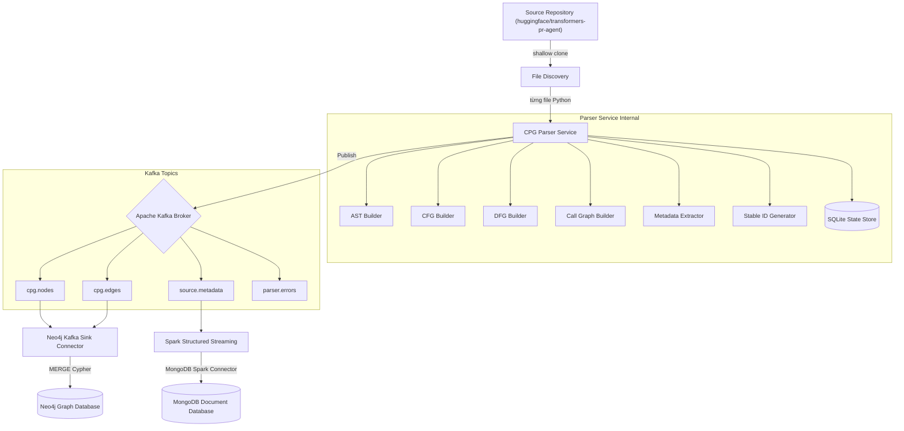

# Sơ đồ Kiến trúc Hệ thống

Báo cáo chi tiết về kiến trúc hệ thống trích xuất Code Property Graph streaming tăng dần.

*(Nội dung đồng bộ với tài liệu `docs/system_architecture.md`)*

## Sơ đồ luồng tổng thể

