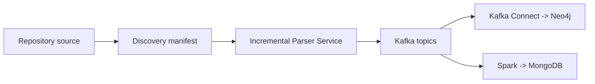

# Lab 04: Incremental Code Property Graph Streaming Pipeline

Báo cáo này trình bày pipeline streaming tăng dần để trích xuất Code Property Graph (CPG) từ repository Python, publish event qua Kafka, rồi ingest vào Neo4j và MongoDB theo hai nhánh xử lý độc lập.

## Mục tiêu

Lab 04 tập trung vào một pipeline dữ liệu lớn có tính incremental:

- discovery repository nguồn bằng snapshot có thể tái hiện;
- parse từng file Python để tạo AST, CFG, DFG và call graph;
- publish node, edge, metadata và parser error events vào Kafka;
- ghi graph topology trực tiếp vào Neo4j bằng Kafka Connect;
- ghi metadata vào MongoDB bằng Spark Structured Streaming;
- kiểm chứng replay bằng stable identifiers, state, upsert và checkpoint.

## Kiến trúc overview

Sơ đồ chi tiết hơn nằm ở chương [Sơ đồ kiến trúc](architecture_diagram.ipynb). Các chương Task 1-6 trình bày runtime evidence cho discovery, parser, Kafka, Neo4j graph ingestion, Spark/MongoDB metadata ingestion và modified-file replay.

## Repository thực nghiệm

| Hạng mục | Giá trị |
|---|---|
| Source repository | `huggingface/transformers-pr-agent` |
| Source commit | `458c957fa1e8851825cd799f5d030876f0644194` |
| Raw Python discovery records | 4.496 |
| Eligible parser inputs | 2.963 |

Các số liệu discovery được tạo từ repository root. Eligible parser inputs là tập record được Parser Service sử dụng sau khi áp dụng rule loại tests, setup/build files và generated files.

## Các chương

| Chương | Nội dung |
|---|---|
| Sơ đồ kiến trúc | Tổng quan pipeline, event streams và incremental replay |
| Task 1 | Clone repository, discovery file Python và manifest |
| Task 2 | Parser Service, stable IDs và incremental state |
| Task 3 | Kafka topics, routing, schema và parser error stream |
| Task 4 | Kafka Connect -> Neo4j graph ingestion |
| Task 5 | Spark Structured Streaming -> MongoDB metadata |
| Task 6 | Modified-file replay verification |

## Kết quả nổi bật

- Task 1 tạo discovery manifest có raw records và eligible parser inputs rõ ràng.
- Task 2 chứng minh parser có thể xử lý smoke sample bằng bounded-memory flow và stable IDs.
- Task 3 xác minh bốn Parser Service topics với Kafka key bằng `file_id`.
- Task 4 xác minh graph events được ingest trực tiếp vào Neo4j, lag trở về 0 và các kiểm tra duplicate/null/placeholder pass trong scenario đã chạy.
- Task 5 xác minh metadata được Spark Structured Streaming consume từ Kafka, ghi/upsert vào MongoDB và resume bằng checkpoint.
- Task 6 xác minh replay một file đã sửa cập nhật Neo4j/MongoDB mà không tạo duplicate và Spark checkpoint không đọc lại offset cũ.

## Cách đọc báo cáo

Nên đọc chương kiến trúc trước để nắm luồng tổng thể, sau đó đi theo Task 1 đến Task 6. Các notebook chứa executed cells và cached outputs; những smoke run trong notebook được dùng để tạo evidence gọn và có thể tái hiện, không được diễn giải thành full Kafka publish nếu notebook không chạy full mode.
